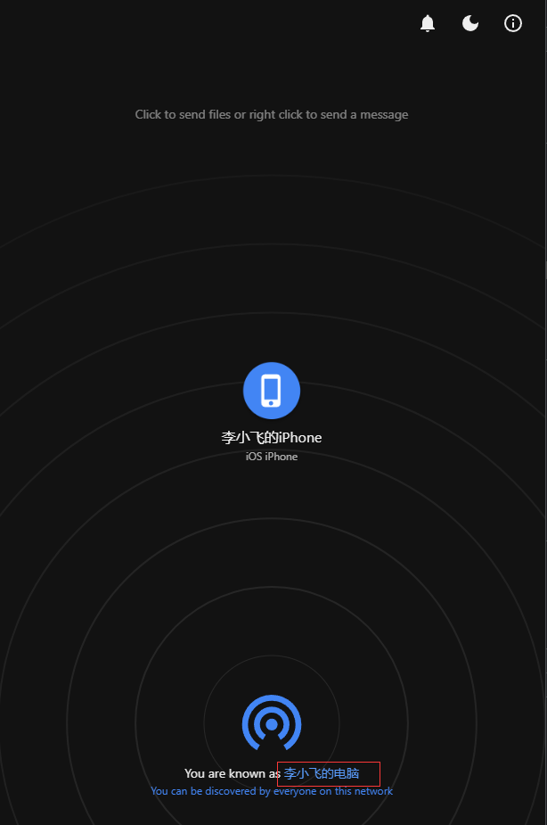

[English](README.md) | 中文

基于[Snapdrop](https://github.com/RobinLinus/snapdrop/tree/eac780092626761602bfe978c8082908c99c3067)的修改版本，主要是加了支持自定义设备名称的功能，方便区分连入同一网络的不同设备。

效果如下图所示
<br>

<br>

当您第一次打开页面的时候，会要求您输入设备名称，并且会将您输入的设备名称保存到浏览器的Cookies中。如果您想修改设备名称，点击上图中红框标出的当前名称即可修改。

您可以直接访问下面URL访问已经搭建的SnapDrop示例。

[https://drop.lixf.cc/](https://drop.lixf.cc/)

SnapDrop的原理是同一局域网(具备同一个公网IP)的设备打开网页后，在初始阶段通过SnapDrop服务器进行互相发现，然后各个设备通过WebRTC协议建立连接以后，后续的文件、文本传输就会通过局域网进行传输(即不再经过公网服务器)。因此通常您不要自己搭建SnapDrop实例，直接访问别人搭建好的实例即可。

如果您想要搭建自己的SnapDrop示例，可以使用Docker镜像[mrlee326/snapdrop](https://hub.docker.com/r/mrlee326/snapdrop)，用下面命令搭建一个HTTP协议的自托管示例。由于部分浏览器会限制只能在HTTPS协议下使用WEBRTC协议，可能你需要使用Nginx进行代理或者自行修改Dockerfile重新构建Docker镜像来达到此目的。

```
docker run --detach --restart=always --name snap_drop -p 8080:80  mrlee326/snapdrop:zh
```